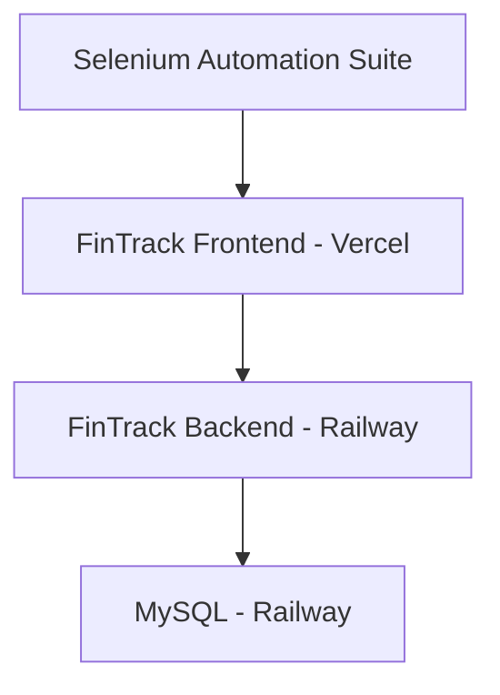

# FinTrack Selenium Automation Suite


A standalone Selenium end-to-end regression suite for the deployed FinTrack personal finance application.

This repository demonstrates external UI automation, positive and negative testing, reusable test architecture, and regression protection for critical user workflows.

> **Separate project:** FinTrack is the application under test. This repository contains only the external Selenium automation suite and does not contain the FinTrack application source code.

- [FinTrack application repository](https://github.com/garrib10/finance-operations-dashboard)

- [Deployed FinTrack application](https://finance-operations-dashboard.vercel.app/)

## Portfolio Story

> I built FinTrack as a full-stack application and then created a separate automated regression suite that validates critical user workflows against the deployed application.

## Tech Stack

| Area                            | Technologies                              |
| ------------------------------- | ----------------------------------------- |
| Language                        | Java 21                                   |
| UI automation                   | Selenium WebDriver 4.49.0                 |
| Test framework                  | JUnit 5.14.4                              |
| Build and dependency management | Maven 3.9.16                              |
| Browser                         | Google Chrome in headed or headless mode  |
| Driver management               | Selenium Manager                          |
| Test architecture               | Page Object Model                         |
| Test reporting                  | Surefire reports and failure artifacts    |
| Configuration                   | Environment variables and `.env` template |
| Continuous integration          | GitHub Actions planned for Day 6          |

WebDriverManager is not currently required because Selenium Manager provides automatic browser-driver discovery and management.

## Project Highlights

- External end-to-end testing against the deployed FinTrack interface

- Page Object Model with focused page and component classes

- Centralized WebDriver creation and JUnit browser lifecycle management

- Fresh browser session for every test

- Explicit waits instead of `Thread.sleep()`

- Stable IDs, semantic elements, accessible names, and `data-testid` selectors

- Assertions kept in test classes rather than hidden inside Page Objects

- Positive and negative authentication coverage

- Parameterized protected-route testing

- Login-session persistence verification after browser refresh

- Logout and post-logout authorization verification

- Duplicate-registration and browser-validation coverage

- Authenticated income and expense transaction workflows

- Transaction creation, verification, editing, cancellation, updating, and deletion

- Description search and transaction-type filtering

- Required-field and minimum-amount validation

- Special-character boundary coverage for transaction descriptions

- Budget creation, verification, editing, cancellation, updating, and deletion

- Budget validation for missing categories, non-positive limits, and duplicate periods

- Dashboard financial-summary verification with balance calculations

- Cross-feature budget, transaction, and dashboard integration testing

- Baseline-and-delta assertions that remain stable with existing account data

- Dynamic budget periods and a dedicated automation category

- Unique test data with automatic cleanup from the deployed application

- Environment-based configuration with credentials excluded from Git

- Repeatable local execution through Maven

- Human-readable and machine-readable Surefire reports

- Configurable headed and headless Chrome execution

- JUnit tags for focused smoke, feature, integration, and regression runs

- Automatic screenshot, page-source, URL, and stack-trace capture on failure

- Sequential execution for workflows that share one deployed automation account

## Application Under Test

The Selenium suite interacts with FinTrack through its deployed frontend.



Tests interact with FinTrack through the browser rather than directly calling its backend or database.

## Current Automated Scenarios

### Smoke Testing

- Deployed FinTrack login page loads successfully

### Authentication

- Registered user can log in

- Authenticated session survives browser refresh

- Invalid password displays the expected error

- User can log out

- Logged-out user cannot revisit a protected route

### Protected Routes

Unauthenticated users are redirected from:

- Dashboard

- Transactions

- Budgets

### Registration Validation

- Duplicate email registration is rejected

- Malformed email is blocked by browser-native validation

Successful registration is not part of routine regression execution because FinTrack does not currently provide account deletion. This prevents automated tests from continually creating permanent users.

### Transactions

- Create and verify an income transaction

- Create and verify an expense transaction

- Cancel an edit without changing the original transaction

- Update a transaction and verify the new values

- Delete a transaction and verify that it is removed

- Preserve apostrophes, quotation marks, and ampersands in descriptions

### Transaction Search and Filtering

- Search using a unique transaction description

- Search using a shared partial description

- Filter matching results by transaction type

- Reset filters before cleanup and subsequent operations

### Transaction Validation

- Reject an amount below the minimum value

- Reject a missing required description

- Verify invalid submissions remain on the transaction page

Transaction scenarios generate unique descriptions for every execution and remove successfully created records in cleanup blocks. This keeps tests independent while safely exercising the deployed application and persistent database.

### Budgets

- Create a budget for a dynamically selected period

- Verify the exact category, month, year, and monthly limit

- Cancel an edit without changing the persisted budget

- Update the monthly limit and verify the new value

- Delete a budget through the native confirmation dialog

- Verify the deleted budget is removed

### Budget Validation

- Reject a budget without a selected category

- Reject a non-positive monthly limit through browser-native validation

- Reject a duplicate category, month, and year combination

- Verify the exact duplicate-budget business error

### Dashboard

- Verify all five financial-summary values load

- Verify current balance equals total income minus total expenses

- Verify monthly income and expenses are non-negative

- Create a current-month budget and matching expense

- Verify total expenses, monthly expenses, and current balance change by the expected amount

- Verify matching budget spending and utilization change

- Verify accessible budget-progress text

The integration workflow records dashboard and budget baselines before creating its expense. Assertions compare expected deltas instead of assuming an empty account. Cleanup removes the transaction before removing its budget.

## Testing and Quality

| Test area                 |                                        Current result |
| ------------------------- | ----------------------------------------------------: |
| Availability smoke        |                                        1 passing test |
| Authentication            |                                       3 passing tests |
| Protected routes          |                    3 passing parameterized executions |
| Registration validation   |                                       2 passing tests |
| Transaction workflows     |                                       4 passing tests |
| Transaction filtering     |                                        1 passing test |
| Transaction validation    |                                       2 passing tests |
| Budget workflows          |                                        1 passing test |
| Budget validation         |                                       3 passing tests |
| Dashboard summary         |                                        1 passing test |
| Cross-feature integration |                                        1 passing test |
| **Total**                 | **22 passing test executions across 11 test classes** |

The `smoke` tag selects three critical checks covering application availability, successful authentication, and dashboard loading. Tagged selections overlap the feature totals above and do not increase the 22-test regression count.

The suite currently verifies:

- Application availability through the UI

- Successful and unsuccessful authentication

- JWT-backed session persistence after refresh

- Logout behavior

- Protected-route enforcement

- Duplicate-email handling

- Browser-native form validation

- Income and expense transaction persistence

- Transaction editing, cancellation, updating, and deletion

- Description search and transaction-type filtering

- Transaction form validation and special-character handling

- Budget persistence, editing, cancellation, updating, and deletion

- Budget field and duplicate-period validation

- Dashboard financial-summary consistency

- Expense effects across dashboard totals and budget utilization

- Accessible budget-progress values

- Baseline-and-delta assertions against persistent deployed data

- Transaction-first and budget-second cleanup

- Unique test-data generation and post-test cleanup

- Browser setup and teardown

- Environment-based credential management

Run the complete suite:

```bash
mvn clean test
```

Run one test class:

```bash
mvn -Dtest=AuthenticationTest test
```

Surefire reports are generated at:

```text
target/surefire-reports
```

The report directory contains:

- Plain-text developer summaries

- XML reports suitable for CI processing and artifact upload

End-to-end code-coverage percentages are not reported because this suite interacts with FinTrack externally and does not instrument the application source code.

## Test Evidence and Screenshots

The framework automatically captures diagnostic evidence whenever a test fails.

Failure evidence is written to:

```text
target/test-artifacts/<TestClass>/
```

Each failed test can produce:

- A PNG browser screenshot

- An HTML page-source snapshot

- A text file containing the test name, current URL, and failure stack trace

These generated files are excluded from Git. They are intended for local diagnosis and future CI artifact upload.

Portfolio evidence will continue to be added as the suite develops.

Planned evidence includes:

- Successful local Maven regression execution

- Headed Chrome automation against deployed FinTrack

- Automatic failure screenshots and diagnostic artifacts

- Successful GitHub Actions workflow execution

- Pull-request status checks

- Maven Surefire reports uploaded as CI artifacts

Screenshots will be stored under:

```text
docs/images
```

Actual image links will be added after the files exist so the README does not contain broken placeholders.

## Project Structure

| Path                                              | Purpose                                                                  |
| ------------------------------------------------- | ------------------------------------------------------------------------ |
| `.env.example`                                    | Safe template documenting required environment variables                 |
| `pom.xml`                                         | Maven project, dependency, Java, compiler, and test-runner configuration |
| `src/test/java/dev/portfolio/fintrack/components` | Reusable UI components shared across pages                               |
| `src/test/java/dev/portfolio/fintrack/config`     | Environment and test configuration                                       |
| `src/test/java/dev/portfolio/fintrack/core`       | WebDriver factory and JUnit test lifecycle                               |
| `src/test/java/dev/portfolio/fintrack/data`       | Unique automation test-data generation                                   |
| `src/test/java/dev/portfolio/fintrack/pages`      | Page Objects containing selectors, waits, and UI interactions            |
| `src/test/java/dev/portfolio/fintrack/tests`      | JUnit test classes containing scenarios and assertions                   |
| `target/surefire-reports`                         | Generated local test reports; excluded from Git                          |
| `target/test-artifacts`                           | Generated failure screenshots and diagnostics; excluded from Git         |
| `docs/images`                                     | Portfolio screenshots and test evidence added later                      |

Current Java structure:

```text
src/test/java/dev/portfolio/fintrack/
|-- components/
|   `-- AppHeader.java
|-- config/
|   `-- TestConfig.java
|-- core/
|   |-- AuthenticatedTest.java
|   |-- BaseTest.java
|   |-- DriverFactory.java
|   `-- FailureEvidenceExtension.java
|-- data/
|   `-- TestData.java
|-- pages/
|   |-- BasePage.java
|   |-- BudgetsPage.java
|   |-- DashboardPage.java
|   |-- LoginPage.java
|   |-- RegisterPage.java
|   `-- TransactionsPage.java
`-- tests/
    |-- AuthenticationTest.java
    |-- BudgetDashboardIntegrationTest.java
    |-- BudgetTest.java
    |-- BudgetValidationTest.java
    |-- DashboardTest.java
    |-- FinTrackSmokeTest.java
    |-- ProtectedRouteTest.java
    |-- RegistrationTest.java
    |-- TransactionFilterTest.java
    |-- TransactionTest.java
    `-- TransactionValidationTest.java
```

## Automation Design

### Page Object Model

Page Objects contain:

- Element selectors

- Explicit waits

- Page-specific interactions

- Page-state accessors

Test classes contain:

- Test scenarios

- Expected outcomes

- JUnit assertions

This separation keeps tests readable while localizing UI-maintenance changes.

### WebDriver Lifecycle

`DriverFactory` creates Chrome in headed mode by default and supports headless execution through configuration. `BaseTest` creates a new driver before every test and closes it afterward.

Each test begins with an isolated browser session and does not depend on authentication state left by another test.

`FailureEvidenceExtension` runs before browser teardown when a test fails, allowing it to capture the active browser state without masking the original failure.

### Test Independence

Tests do not depend on execution order. Authentication tests reuse one dedicated fictional account, while permanent account creation is excluded from routine execution.

Transaction tests create uniquely named records and use `finally` cleanup blocks so created data is removed even when an assertion fails. Budget tests use a dedicated configured category and dynamically selected periods to avoid modifying existing records.

The dashboard integration test records existing totals and budget values before making changes. It verifies numeric deltas, removes the generated transaction first, and removes the generated budget second. Test runs are currently serial because the suite operates against one shared deployed automation account.

### Explicit Waits

The suite waits for observable browser conditions, including:

- Expected URL paths

- Visible elements

- Clickable controls

- Authenticated navigation

- Loaded dashboard content

- Transaction form resets after successful submission

- Search and filter results

- Transaction rows appearing or disappearing after mutations

- Budget periods becoming selected

- Budget cards appearing, updating, or disappearing

- Dashboard summaries and budget-progress cards loading

Fixed delays such as `Thread.sleep()` are not used.

### Test Tags

JUnit tags support focused execution without maintaining separate suites:

| Tag              | Scope                                                     |
| ---------------- | --------------------------------------------------------- |
| `smoke`          | Availability, successful login, and dashboard loading     |
| `authentication` | Login, logout, registration, and protected routes         |
| `transactions`   | Transaction workflows, filtering, and validation          |
| `budgets`        | Budget workflows, validation, and related integration     |
| `dashboard`      | Dashboard summary and cross-feature dashboard behavior    |
| `integration`    | Cross-feature budget, transaction, and dashboard workflow |
| `regression`     | Complete automated regression coverage                    |

The suite remains sequential because several workflows share the same deployed automation account and persistent test data.

### Selector Strategy

The suite prefers:

1. Stable element IDs

2. Released `data-testid` attributes

3. Semantic HTML and accessible names

4. Scoped CSS selectors

5. Short, meaning-based XPath only when Selenium lacks a suitable role locator

DOM-position-based selectors and long absolute XPath expressions are avoided.

## Local Prerequisites

- Java 21

- Maven 3.9 or later

- Google Chrome

Verify the environment:

```bash
java -version

mvn -version
```

Maven should report that it is running with Java 21.

## Environment Configuration

Copy the safe configuration template:

```bash
cp .env.example .env
```

Update `.env` with a dedicated fictional FinTrack automation account:

```bash
export FINTRACK_BASE_URL='https://finance-operations-dashboard.vercel.app'

export FINTRACK_TEST_EMAIL='replace-with-dedicated-test-email'

export FINTRACK_TEST_PASSWORD='replace-with-dedicated-test-password'

export FINTRACK_ALLOW_REGISTRATION='false'

export FINTRACK_TEST_BUDGET_CATEGORY='Travel'

export FINTRACK_HEADLESS='false'
```

Load the values into the current terminal:

```bash
source .env
```

The real `.env` file is excluded from Git and must never be committed.

## Running the Tests

Run all tests from a clean build:

```bash
source .env

mvn clean test
```

Run one test class:

```bash
mvn -Dtest=AuthenticationTest test
```

Run the complete suite headlessly:

```bash
mvn clean test -Dheadless=true
```

Run the tagged smoke selection headlessly:

```bash
mvn -Dgroups=smoke -Dheadless=true test
```

Run a feature tag:

```bash
mvn -Dgroups=transactions test

mvn -Dgroups=budgets test
```

Run the complete regression tag:

```bash
mvn -Dgroups=regression -Dheadless=true test
```

Run the protected-route tests:

```bash
mvn -Dtest=ProtectedRouteTest test
```

Run all transaction test classes:

```bash
mvn -Dtest="Transaction*" test
```

Run all budget and dashboard test classes:

```bash
mvn -Dtest=BudgetTest,BudgetValidationTest,DashboardTest,BudgetDashboardIntegrationTest test
```

The browser runs visibly by default. The `-Dheadless=true` Maven property overrides `FINTRACK_HEADLESS` for the current command.

## Test Reports

Maven Surefire generates results in:

```text
target/surefire-reports
```

View the readable test summaries:

```bash
cat target/surefire-reports/*.txt
```

Generated reports are excluded from Git because they are recreated during every test run. GitHub Actions will upload them as temporary workflow artifacts once CI is configured.

Failure diagnostics are generated at:

```text
target/test-artifacts
```

Both generated directories are removed by `mvn clean`.

## Roadmap

- [x] Day 1 - Maven, Selenium, JUnit, and first browser test

- [x] Day 2 - Configuration, Page Object Model, and authentication automation

- [x] Day 3 - Transaction workflows

- [x] Day 4 - Budget and dashboard workflows

- [x] Day 5 - Reliability, tagging, screenshots, and headless execution

- [ ] Day 6 - GitHub Actions and automated PR checks

- [ ] Day 7 - Final documentation, evidence, and v1.0 release

## Current Status

Version `1.0.0-SNAPSHOT` is under active development.

Authentication, transaction, budget, dashboard, and cross-feature integration automation are complete with 22 passing test executions across 11 test classes. The suite supports headed and headless execution, focused JUnit tags, explicit-wait-based synchronization, and automatic failure evidence. GitHub Actions, automated pull-request checks, final portfolio evidence, and the v1.0 release remain.
